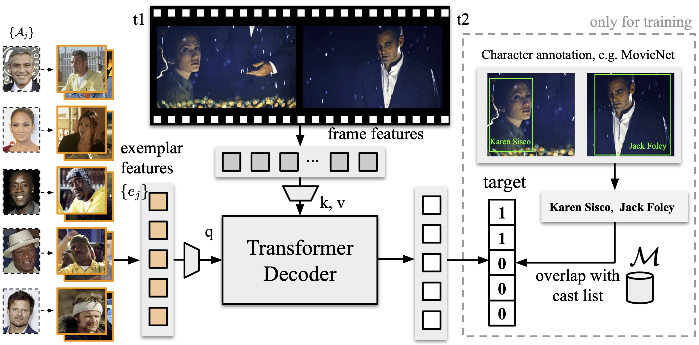
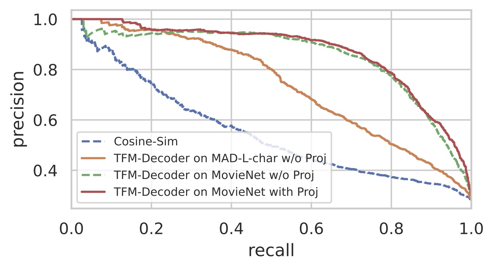

## Character recognition module

This module takes movie cast list (including name and profile pictures) and movie frame features as inputs, 
and outputs the on-screen characters by visual feature matching.

### Preparation
1. We download actor profile pictures from IMDB page. The collection of pictures can be downloaded [here (27GB)](https://thor.robots.ox.ac.uk/autoad/actor_profiles.tar).
2. We extract CLIP image features for these actor profile pictures with [./extract_clip_face.py](./extract_clip_face.py). The extracted image features can be downloaded [here](http://www.robots.ox.ac.uk/~htd/autoad/audiovault_face_ViT-L-14.pth.tar).
3. We download cast list from IMDB page. The collection of cast list (text data) can be downloaded [here](http://www.robots.ox.ac.uk/~htd/autoad/audiovault_actors.csv).
4. We download [MovieNet dataset](https://movienet.github.io/) and extract their frame features with the [same script](./extract_clip_face.py). We post-processed their face annotations for easy loading: download [here](http://www.robots.ox.ac.uk/~htd/autoad/movienet_face_anno.csv)

### Find in-context exemplar
1. For actor profile pictures, we compare them with the movie frame features, and find their nearest neighbours, as the in-context exemplars. The scripts are [./build_exemplar_mad.py](./build_exemplar_mad.py) and [./build_exemplar_movienet.py](./build_exemplar_movienet.py).

### Train character recognition module
1. After all the preparations above, we train a simple character recognition module on MovieNet faces with this script [./recog_main.py](./recog_main.py)
2. We inference the trained character recognition module on MAD movie features to recognize on-screen characters. The inference output can be downloaded [here](http://www.robots.ox.ac.uk/~htd/autoad/MAD_char_prob_dict_trainval_MV550_CBcharbank_cos_top10_cal_jul.pkl).

### Results
When evaluated on a subset of MovieNet movies, 
the transformer-based character recognition module outperforms baselines by a large margin.

