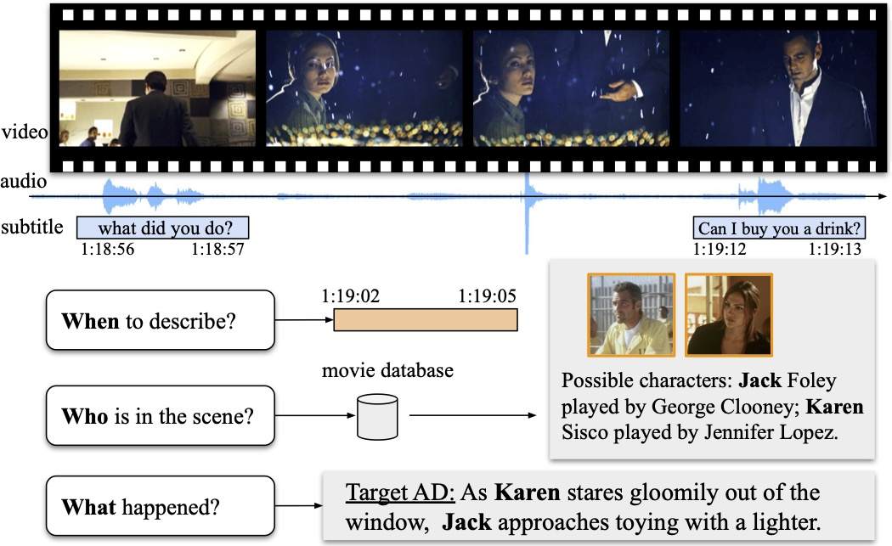

## AutoAD-II 
The codebase for *AutoAD II: The Sequel - Who, When, and What in Movie Audio Description*.
[[project page]](https://www.robots.ox.ac.uk/~vgg/research/autoad/)
[[AutoAD-II PDF]](https://www.robots.ox.ac.uk/~vgg/publications/2023/Han23a/han23a.pdf)



### Code and Models
We are working on open-sourcing code and models.

### Reference
```bibtex
@InProceedings{han2023autoad2,
  title={{AutoAD II: The Sequel} - Who, When, and What in Movie Audio Description},  
  author={Tengda Han and Max Bain and Arsha Nagrani and G\"ul Varol and Weidi Xie and Andrew Zisserman},  
  booktitle={ICCV},  
  year={2023}}
```
