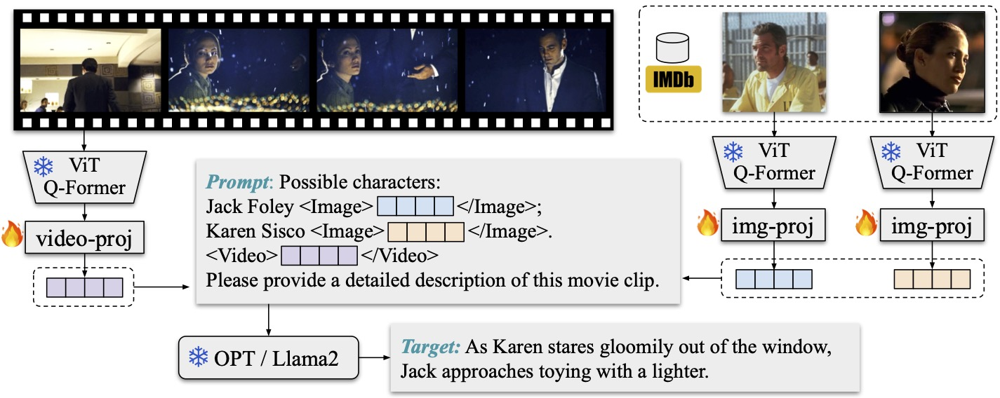

# AutoAD Project

* AutoAD III: The Prequel -- Back to the Pixels. [CVPR'24]. T. Han, M. Bain, A. Nagrani, G. Varol, W. Xie and A. Zisserman.
* AutoAD II: The Sequel – Who, When, and What in Movie Audio Description [ICCV'23]. T. Han, M. Bain, A. Nagrani, G. Varol, W. Xie and A. Zisserman.
* AutoAD I: Movie Description in Context [CVPR'23 Highlight]. T. Han*, M. Bain*, A. Nagrani, G. Varol, W. Xie and A. Zisserman.

[[project page]](https://www.robots.ox.ac.uk/~vgg/research/autoad/)
[[AutoAD-III PDF]](https://www.robots.ox.ac.uk/~vgg/publications/2024/Han24/han24.pdf)
[[AutoAD-II PDF]](https://www.robots.ox.ac.uk/~vgg/publications/2023/Han23a/han23a.pdf)
[[AutoAD-I PDF]](https://www.robots.ox.ac.uk/~vgg/publications/2023/Han23/han23.pdf)

### News :mega:
* 2024.04.22: AutoAD-III paper released. Model weights and examples AD outputs are [available here](autoad_iii/). More code and datasets coming soon.





### Details
* AutoAD-III: [autoad_iii/](autoad_iii/)
* AutoAD-II: [autoad_ii/](autoad_ii/)
* AutoAD-I: [autoad_i/](autoad_i/)


### Reference
```bibtex
@InProceedings{han2024autoad3,
  title={{AutoAD III: The Prequel} - Back to the Pixels},  
  author={Tengda Han and Max Bain and Arsha Nagrani and G\"ul Varol and Weidi Xie and Andrew Zisserman},  
  booktitle={CVPR},  
  year={2024}}

@InProceedings{han2023autoad2,
  title={{AutoAD II: The Sequel} - Who, When, and What in Movie Audio Description},  
  author={Tengda Han and Max Bain and Arsha Nagrani and G\"ul Varol and Weidi Xie and Andrew Zisserman},  
  booktitle={ICCV},  
  year={2023}}

@InProceedings{han2023autoad1,
  title={{AutoAD}: Movie Description in Context},  
  author={Tengda Han and Max Bain and Arsha Nagrani and G\"ul Varol and Weidi Xie and Andrew Zisserman},  
  booktitle={CVPR},  
  year={2023}}
```

