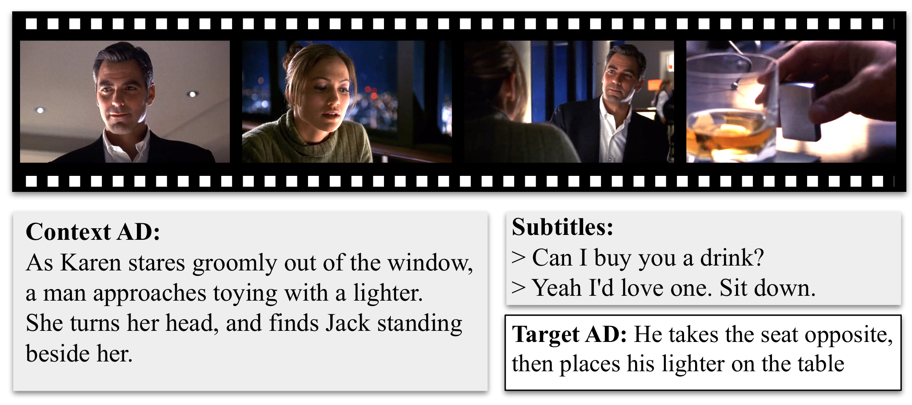

# AutoAD Project

* AutoAD II: The Sequel – Who, When, and What in Movie Audio Description [ICCV'23]. Tengda Han, Max Bain, Arsha Nagrani, Gül Varol, Weidi Xie and Andrew Zisserman.
* AutoAD I: Movie Description in Context [CVPR'23 Highlight]. Tengda Han*, Max Bain*, Arsha Nagrani, Gül Varol, Weidi Xie and Andrew Zisserman.

[[project page]](https://www.robots.ox.ac.uk/~vgg/research/autoad/)
[[AutoAD-I PDF]](https://www.robots.ox.ac.uk/~vgg/publications/2023/Han23/han23.pdf)
[[AutoAD-II PDF]](https://www.robots.ox.ac.uk/~vgg/publications/2023/Han23a/han23a.pdf)



### Dataset Preparation
The following three datasets can be downloaded from the [MAD](https://github.com/Soldelli/MAD) team:
* MAD-v2-Named
* MAD-v2-Unnamed
* MAD Subtitles
Please request access through them and download the datasets.

The following text-only datasets can be downloaded from VGG's server:
* AudioVault-AD [download](http://www.robots.ox.ac.uk/~htd/autoad/ad-movie8k-v3-nomadnolsmdc_NSSD_jaesung_0p95_minAD100_pronthresh0p05.csv)
* AudioVault-Sub [download](http://www.robots.ox.ac.uk/~htd/autoad/subs-movie8k-v3-nomadnolsmdc_NSSD_jaesung_0p95_minAD100_pronthresh0p05.csv) (not used in the paper)

We also used [Conceptual Caption 3M](https://ai.google.com/research/ConceptualCaptions/) 
and [WebVid 2.5M](https://github.com/m-bain/webvid) datasets in our paper.
Please check their Terms of Use before downloading.

### AD/Subtitle Collection Scripts
To get the AD/Subtitle (text) from the mixed audio track,
our pipeline uses [WhisperX](https://github.com/m-bain/whisperX) for ASR followed by speaker diarization, speaker identification and synchronization. 
Detailed pipeline script will be released soon.

### Model and Scripts
* AutoAD-I: [autoad_i/](autoad_i/)
* AutoAD-II: [autoad_ii/](autoad_ii/)

### Reference
```bibtex
@InProceedings{han2023autoad2,
  title={{AutoAD II: The Sequel} - Who, When, and What in Movie Audio Description},  
  author={Tengda Han and Max Bain and Arsha Nagrani and G\"ul Varol and Weidi Xie and Andrew Zisserman},  
  booktitle={ICCV},  
  year={2023}}

@InProceedings{han2023autoad1,
  title={{AutoAD}: Movie Description in Context},  
  author={Tengda Han and Max Bain and Arsha Nagrani and G\"ul Varol and Weidi Xie and Andrew Zisserman},  
  booktitle={CVPR},  
  year={2023}}
```

